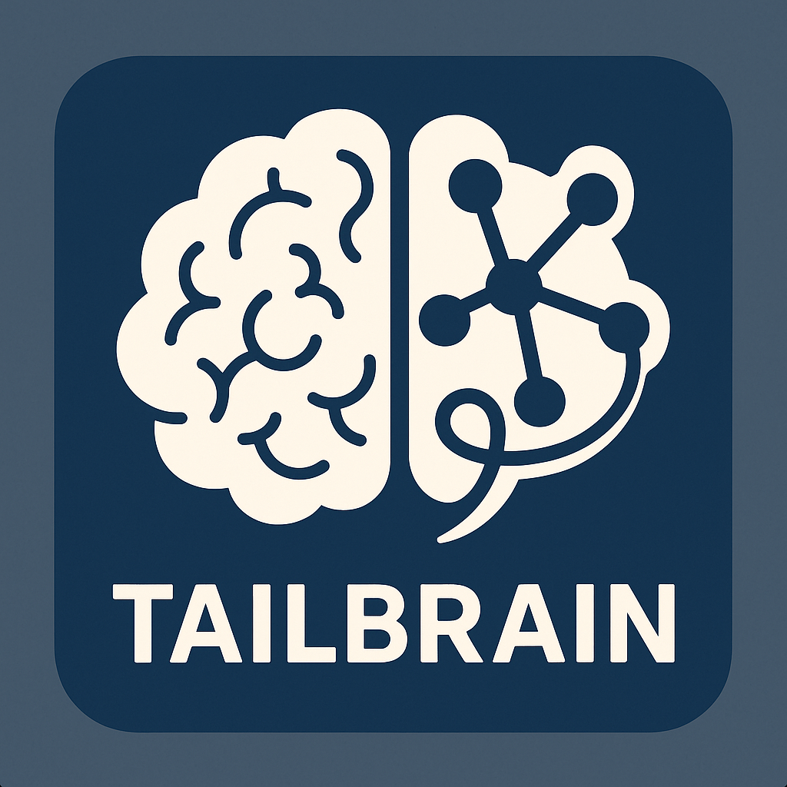

<div align="center">
  
  <h1>✨ TailBrain ✨</h1>
</div>

**A web dashboard to monitor and manage Tailscale serve/funnel ports, Docker containers, and Docker Compose applications.**

---

## 🚀 Features

- 👀 Monitor Tailscale `serve` ports
- 📡 Monitor Tailscale `funnel` configurations
- 🐳 View Docker containers with clickable links to services
- 🌐 **Manage Docker Container Networks:**
  - View networks a container is connected to.
  - Connect containers to existing Docker networks.
  - Disconnect containers from networks.
- ➕ Add/remove Tailscale `serve` ports
- ➖ Add/remove Tailscale `funnel` ports
- 🚢 Manage Docker Compose applications (`up`/`down`)
- 🏗️ Create and delete Docker networks.

---

## 📋 Requirements

- 🐍 **Python 3**: v3.7+ recommended (for the backend, host relay, and startup script).
- 📦 **pip**: Python package installer (usually comes with Python).
- 🐳 **Docker & Docker Compose**: For deployment and Docker Compose management. Ensure Docker Desktop or Docker Engine (with Compose plugin V2 `docker compose` or standalone `docker-compose`) is installed and running.
-  **Tailscale**: Installed and configured on the host machine, with the `tailscale` CLI command available in the system PATH.
-  **Node.js & npm**: v16+ (for frontend development, building the frontend, and running utility scripts like `concurrently`).

---

## 🖥️ Platform Compatibility

TailBrain is designed to work on Windows, Linux, and macOS systems.

### 🪟 Windows Users
- Ensure Docker Desktop is installed and running.
- The `start.py` script attempts to locate `docker.exe` and `tailscale.exe`. If not found in PATH, ensure they are in standard installation locations or add them to your system PATH.
- The Python Host Relay may open in a new console window.

### 🐧 Linux/macOS Users
- Ensure Docker, Docker Compose, Python 3, pip, Node.js, and npm are installed.
- Ensure `docker`, `docker-compose` (or `docker compose`), and `tailscale` commands are in your system PATH.
- Make sure the user running TailBrain has permissions to access the Docker socket (see [Troubleshooting](#docker-socket-access)).

---

## 🚀 Quick Start with `start.py` (Recommended)

This is the easiest way to get TailBrain up and running. The `start.py` script orchestrates the entire process.

1.  **📥 Clone the Repository:**
    ```bash
    git clone <repository-url> # Replace <repository-url> with the actual URL
    cd tailbrain
    ```

2.  **🛠️ Install Dependencies:**
    *   **Python Host-Side Dependencies:** These are for `start.py` and the Python relay system.
        ```bash
        # Ensure Python 3 and pip are installed and in your PATH
        python -m pip install -r requirements.txt 
        ```
        (This installs `requests`, `Flask`, `Flask-CORS` for the host scripts.)
    *   **Node.js Project Dependencies:** These are for frontend development tools (like Vite) and utility scripts (like `concurrently`).
        ```bash
        # Ensure Node.js and npm are installed and in your PATH
        npm install
        ```

3.  **🚀 Start the Application using `start.py`:**
    Run the main startup script:
    ```bash
    python start.py
    ```
    The `start.py` script will:
    - Perform prerequisite checks (Python, Docker, Tailscale, npm, Flask).
    - Offer to stop any existing TailBrain Docker containers (`docker-compose down`).
    - Automatically start the Python Host Command Relay in the background.
    - Perform a health check on the relay.
    - Ask if you want to build/rebuild Docker images (`docker-compose build`).
    - Automatically start the main TailBrain application services (`docker-compose up -d`).
    - Perform a health check on the main application.
    - If successful, automatically open TailBrain in your default web browser.
    - The `start.py` script will then exit.

4.  🎉 **Access TailBrain:**
    If not opened automatically, navigate to `http://localhost:7654` in your browser.
    The Python Host Command Relay runs on port `7655`.

5.  **🛑 Stopping TailBrain:**
    *   **Docker Services:** Navigate to the `tailbrain` directory in a terminal and run:
        ```bash
        # If you have Docker Compose V2 (plugin)
        docker compose down 
        # Or, if you have standalone docker-compose
        # docker-compose down
        ```
        (The `start.py` script will indicate which compose command was found).
    *   **Python Host Command Relay:**
        - On Windows, if the relay started in a new window: Close that console window manually.
        - On Linux/macOS: The relay process (`python start_relay.py`) was started in the background. You may need to find its Process ID (PID) and use `kill <PID>`. The PID is logged by `start_relay.py` when it launches `host_command_relay.py` (check `relay_service_stdout.log`).

---

## 📡 Understanding the Python Host Command Relay

TailBrain's backend (running inside a Docker container) needs to execute commands like `tailscale`, `docker`, and `docker-compose` on your host machine. This is achieved via the **Python Host Command Relay**.

- **How it works:** The `start.py` script (via `start_relay.py`) launches a small Python/Flask server (`host_command_relay.py`) directly on your host machine.
- This server listens on port `7655` by default.
- The TailBrain Docker container (running the Python backend) is configured via the `HOST_RELAY_URL` environment variable (set in `docker-compose.yml` to `http://host.docker.internal:7655`) to send command requests to this relay.
- The `start.py` script attempts to find the full paths to `docker` and `tailscale` and provides them to the relay via environment variables (`DOCKER_CMD_PATH`, `TAILSCALE_CMD_PATH`) for more robust execution.

---

## 🎆 Using with Tailscale

- Ensure Tailscale is installed and running on your host.
- The `tailscale` command must be findable by `start.py` (either in PATH or common locations) for the relay to use it.

---

## 🗂️ Docker Compose Management

Functionality remains the same:
- Add, view, and manage Docker Compose applications.
- Paths to `docker-compose.yml` files should be absolute paths on your host machine.
- Configurations are stored in `data/compose-apps.json` (persisted via Docker volume `tailbrain_data`).

---

## 🐳 Docker Container Management

Functionality remains the same:
- View containers, manage lifecycle (stop, kill, restart), inspect logs/stats.
- Manage container network connections.
- View, create, and delete Docker networks.

---

## 🛠️ Development Setup (Advanced)

If you want to run the frontend and new Python backend services locally *without Docker* for development:

1.  **📥 Clone Repository** (if not already done).
2.  **📦 Install Dependencies:**
    *   **Host-Side Python Dependencies (for relay and `start.py`):**
        ```bash
        python -m pip install -r requirements.txt
        ```
    *   **Python Backend Dependencies:** Create a virtual environment for the backend, then install its requirements.
        ```bash
        # From project root
        python -m venv .venv-backend
        # Activate (Linux/macOS): source .venv-backend/bin/activate
        # Activate (Windows CMD): .venv-backend\Scripts\activate.bat
        # Activate (Windows PowerShell): .venv-backend\Scripts\Activate.ps1
        pip install -r python_backend/requirements.txt
        ```
    *   **Node.js Project & Frontend Dependencies:**
        ```bash
        npm install # For root devDependencies like concurrently
        npm install --prefix frontend # For React, Vite, etc.
        ```
3.  **⚙️ Start Development Servers:**
    *   **Python Host Command Relay (manual start):**
        In one terminal, from the project root:
        ```bash
        python start_relay.py 
        ```
        (Ensure `DOCKER_CMD_PATH` and `TAILSCALE_CMD_PATH` are set in this terminal's environment if needed, or rely on `host_command_relay.py` finding them via `shutil.which`).
    *   **Main Application (Frontend + Python Backend concurrently):**
        In another terminal, from the project root:
        ```bash
        npm run dev
        ```
        This uses `concurrently` to run:
        - `npm run dev:frontend` (Vite dev server for React frontend on `http://localhost:5173` by default).
        - `npm run dev:backend` (Flask dev server for Python backend on `http://localhost:7654` by default).
        The frontend will make API calls to the Python backend.

---

## 🔍 Troubleshooting

### ⚠️ Docker Socket Access Denied
(This section remains relevant if Docker commands were to be run directly from a container, less so now with the relay but good general info).
- **Linux:** Ensure your user is part of the `docker` group: `sudo usermod -aG docker $USER`. Then, **log out and log back in**.

### ❓ `docker`/`tailscale` Command Not Found by Relay
If the relay logs show "'docker' is not recognized..." or similar:
1.  Verify Docker/Tailscale are installed on your host.
2.  Ensure their executables are in your system's PATH and that this PATH is accessible to the environment where `python start.py` (and subsequently the relay scripts) are run. Restart your terminal after PATH changes.
3.  `start.py` attempts to find these, but a correct PATH is the most reliable solution. The relay logs its own PATH on startup for diagnostics.

### 📂 Path to Docker Compose Files
When adding Docker Compose applications in TailBrain, provide the **absolute path** to the `docker-compose.yml` file as it exists on your host machine.

### 🤯 Docker Build Issues
(This section on Docker build issues like "Failed to prepare extraction snapshot" remains generally relevant).

---

## 🏗️ Building from Source (After Code Changes)

If you've modified TailBrain's code:
- **Frontend:** The Vite dev server (`npm run dev:frontend`) provides hot reloading. For a production build, run `npm run build:frontend`.
- **Python Backend:** The Flask dev server (`npm run dev:backend`) provides auto-reloading for Python code changes.
- **Docker Image:** If using Docker, rebuild the image after code changes:
  ```bash
  # (docker-compose build is also an option in start.py)
  docker-compose build 
  # Then restart services
  docker-compose up -d
  ```

---

## 🤝 Contributing

Contributions are welcome! Please feel free to submit a Pull Request.

---

<div align="center">
  <small>Happy Tailgating & Dockering with Python!</small>
</div>
